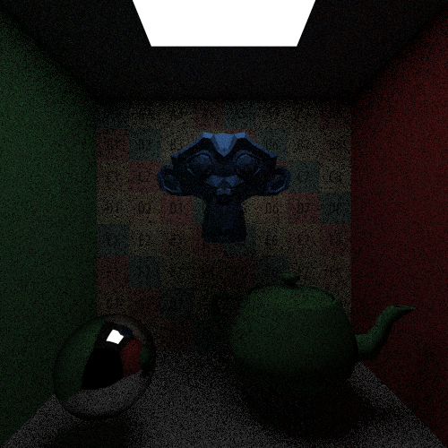

#Raytracer
Per usare il raytracer è necessario creare un istanza della classe Renderer e chiamare il metodo .render() che 
utilizza la telecamera e la scena passata per eseguire il render all'interno del buffer color, che deve essere stato
precedentemente creato.

##Creazione della scena
La scena viene costruita creando una struttura gerarchica usando la classe Node che permette di generare
un nodo vuoto (Node()) o un nodo con una geometria e un materiale (Node(geometry, material)).
Ogni nodo e la mesh contenuta devono fornire dei metodi che permettono di controllare
se la mesh interseca il raggio (rispettivamente hit per i nodi e intersect per le mesh contenute nei nodi)

##Trasformazioni
Le trasformazioni sono implementate applicando l'inverso della trasformazione dell'oggetto al raggio, soluzione
scelta poichè permette di calcolare le intersezioni raggio-mesh sempre in object space.
Le intersezioni trovate vengono poi riportate in world space applicando la trasformazione dell'oggetto
(l'inversa dell'inversa).

##Metodi di accelerazione
Ogni mesh può implementare i suoi metodi di accelerazione.
Alcune (come le sfere, piani etc) non implementano alcuna struttura (dato che il calcolo delle intersezioni è immediato),
altri (come le TriangleMesh) possono scegliere di creare una griglia 3D (RegularGrid) 
chiamando il metodo .buildAccelerationStructure() per velocizzare il calcolo delle intersezioni.
Per semplicità e pulizia del codice la ricerca esaustiva di intersezioni è stata implementata come
una struttura di accelerazione (ExhaustiveSearch)

##Il metodo render
Il metodo render:
- crea la BVH
- Inizializza l'integratore
- divide il buffer in Tile e assegna un thread a ciascuna Tile, 
- avvia (per ogni thread) il metodo trace_tile sulla tile assegnata al thread

Il metodo trace_tile esegue il render della zona di schermo (Tile) assegnata al thread usando
l'integratore e la bvh.

Il parametro n_tiles nella classe renderer controlla il numero di tiles, 
il buffer viene diviso in n_tiles*n_tiles.

##Integratori
L'integratore è il componente che si occupa di inviare i raggi nella scena e campionarne le proprietà, 
non tutti gli integratori infatti campionano il colore, ad esempio l'integratore NormalDebugIntegrator
campiona le normali degli oggetti, invece il BackwardIntegrator esegue il backward ray tracing sulla scena
campionando i materiali per ogni intersezione.

##Materiali
Nel renderer sono disponibili materiali di base (Lambertian, Metal, Light, Dielectric).
Per creare nuovi materiali è necessario subclassare la classe Material e implementare le 2 funzioni:
- scatter: Ritorna vero se il materiale quando viene colpito dalla luce genera dei raggi in uscita(riflessione o rifrazione), falso altrimenti.
- color: Ritorna il colore del materiale quando viene colpito dalla luce, il colore della
luce proveniente viene passato nella variabile incoming, se il materiale non genera raggi quando colpito dalla luce
questa variabile sarà sempre non definita.

##Updater
è possibile comunicare al renderer di chiamare una funzione per mettere in output statistiche sul processo di rendering,
chiamando la funzione set_updater(interval, function) il renderer chiamerà function ogni interval millisecondi passandogli
un parametro di tipo RenderInfo con i valori del renderer (ad esempio sample completati su sample necessari).

##Output
Per eseguire l'output di un buffer su cui è stato fatto il rendering è necessario creare un'istanza di una delle
classi derivate da RenderOutput che permettono di implementare diverse metodologie per
salvare i buffer (ad esempio FileRenderOutput salva su file), a questa istanza della classe non è
possibile passare direttamente il buffer dato che questo è in un formato interno al renderer,
per trasformare questo formato interno in un formato scrivibile su file è possibile usare i derivati della
classe ColorBufferFormat che trasformano il buffer interno in una stringa pronta ad essere scritta su file
(Ad esempio ColorBufferFormatPPM trasforma il buffer nel formato PPM), questo permette di salvare il 
buffer su file con diversi formati.

##Vulkan
Alla fine del render la classe WindowOutput può essere usata per visualizzare in una finestra il risultato del
rendering usando l'API Vulkan.

Perchè il programma funzioni è necessario avere le librerie di vulkan e glfw e compilare gli shader con le istruzioni:
- glslc ./Shaders/image.frag -o ./build/shaders/image.frag
- glslc ./Shaders/vert.vert -o ./build/shaders/vert.vert  

In cui glslc è un programma per compilare gli shader nel formato SPIR-V e la cartella build
è la cartella generata da CMAKE che contiene l'eseguibile
